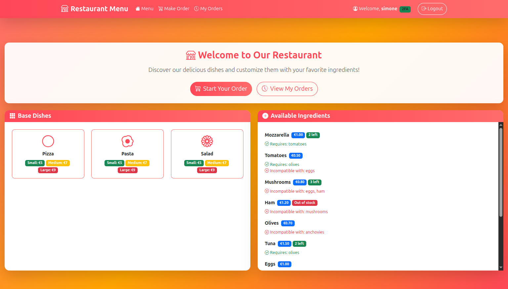
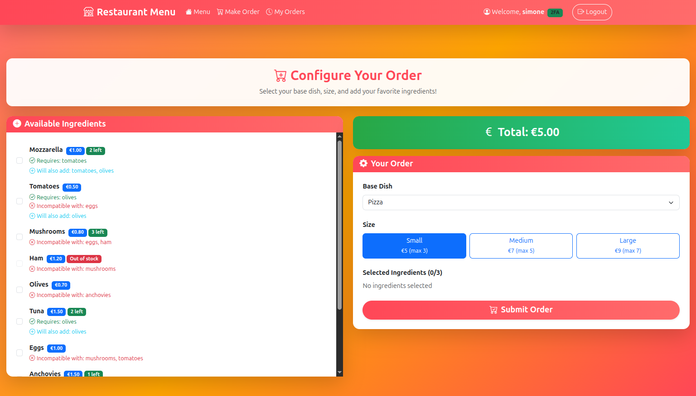
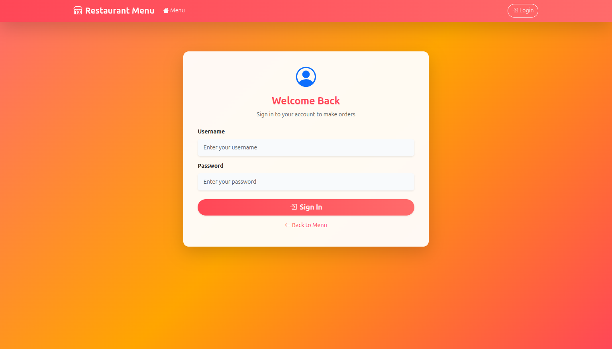
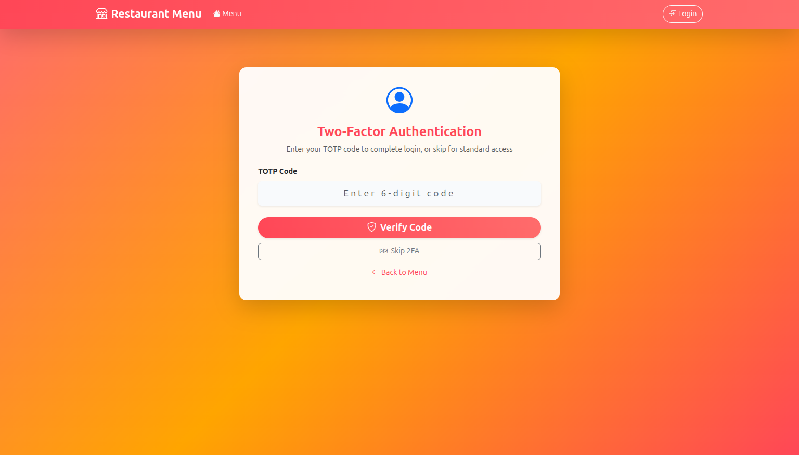
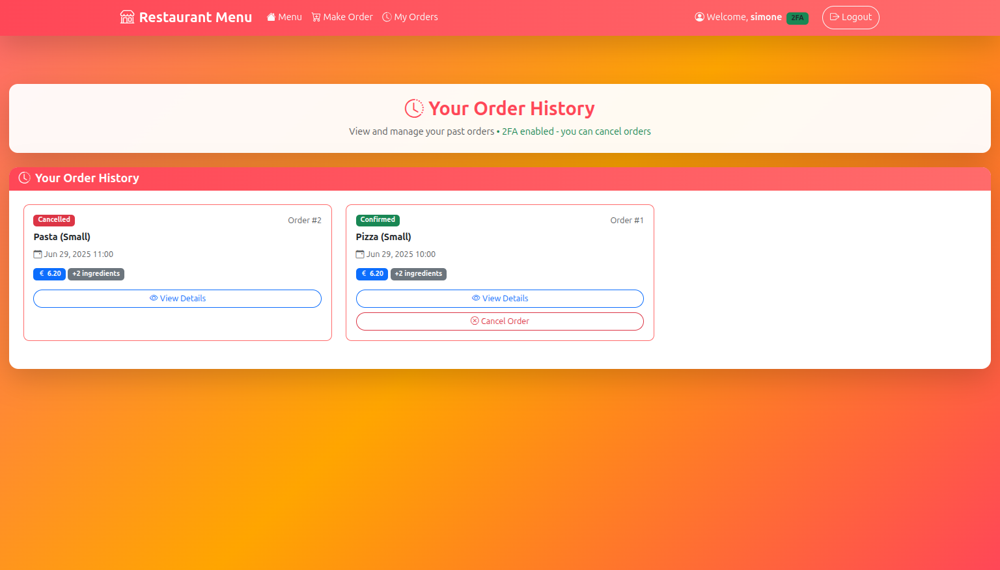
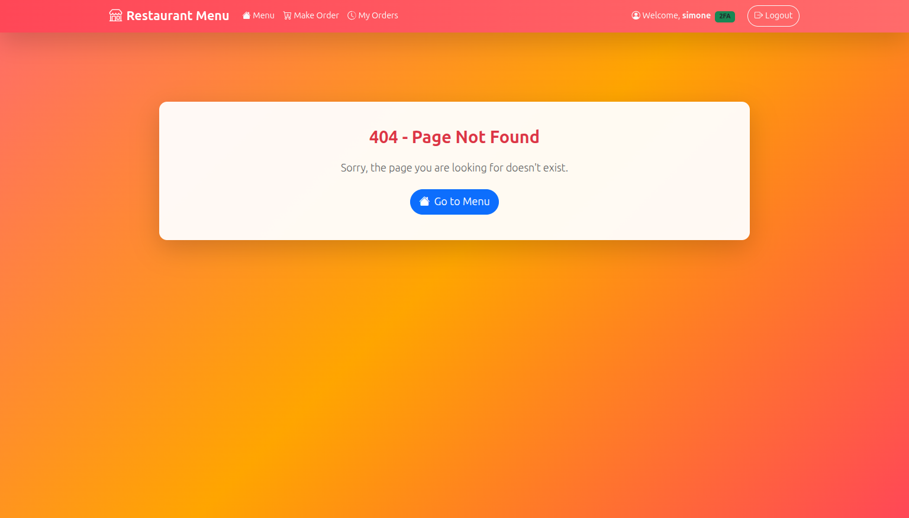

# Restaurant Ordering System - Web Application Project

Student: s344024 Simone Romano

## 1. Server-side

### API Server

#### Authentication APIs
- `POST /api/sessions` - User login. Body: `{username, password}`. Returns user info with canDoTotp flag.
- `POST /api/login-totp` - TOTP verification. Body: `{code}`. Returns success confirmation.
- `DELETE /api/sessions/current` - User logout. Returns 200 status.
- `GET /api/sessions/current` - Get current user information and session status.

#### Menu APIs
- `GET /api/dishes` - Retrieve all available dishes with sizes and pricing information.
- `GET /api/ingredients` - Get all ingredients with availability counts and dependencies.

#### Order APIs
- `POST /api/orders` - Create new order. Body: `{dishId, size, ingredients}`. Returns order confirmation.
- `GET /api/orders` - Get user's order history with complete details and ingredients.
- `DELETE /api/orders/:id` - Cancel specific order (if cancellation is allowed).

### Database Tables

- **users**: User authentication and profile data. Columns: `id`, `username`, `password`, `totp_required`.
- **dishes**: Base dishes available for ordering. Columns: `id`, `name`.
- **dish_sizes**: Size variants for dishes. Columns: `id`, `dish_id`, `size`, `price`, `max_ingredients`.
- **ingredients**: Available ingredients with stock management. Columns: `id`, `name`, `price`, `availability`.
- **ingredient_dependencies**: Required ingredient relationships. Columns: `id`, `ingredient_id`, `required_ingredient_id`.
- **ingredient_incompatibilities**: Incompatible ingredient pairs. Columns: `id`, `ingredient_id`, `incompatible_ingredient_id`.
- **orders**: Customer orders with status tracking. Columns: `id`, `user_id`, `dish_id`, `size`, `total`, `date`, `cancelled`.
- **order_ingredients**: Many-to-many relationship between orders and ingredients. Columns: `order_id`, `ingredient_id`.

## 2. Client-side

### Application Routes

- `/` - Main menu browser displaying available dishes with ingredient browsing capabilities.
- `/order` - Interactive order configurator with ingredient selection and real-time pricing.
- `/orders` - Order history management with detailed view and cancellation capabilities.
- `/login` - User authentication with username/password and optional 2FA verification.
- `*` - 404 Not Found page for invalid routes.

### Main React Components

#### Core Application Components
- **App** - Root component managing global authentication state, routing, and centralized error handling.
- **LoginWithTotp** - Authentication flow controller handling login and TOTP verification logic.

#### Layout Components
- **NavigationBar** - Top navigation with user info, authentication status, and main navigation links.
- **Layout (MenuLayout, LoginLayout, OrderLayout, OrderHistoryLayout, NotFoundLayout)** - Page-specific layout wrappers with consistent structure.

#### Authentication Components
- **LoginForm** - User authentication form with username/password fields and TOTP code input.

#### Menu and Ordering Components
- **MenuBrowser** - Dish selection interface with filtering and ingredient browsing capabilities.
- **OrderConfigurator** - Interactive ingredient selection with dynamic pricing, dependency validation, and incompatibility checking.
- **OrderHistory** - Past orders display with detailed ingredient lists, cancellation options, and order status.

## 3. Overall

### Screenshots

#### Main Menu Page

Main restaurant menu browser showing available dishes and ingredients with interactive browsing capabilities.

#### Order Configuration Page (Ingredient Selection)

Interactive order configurator with ingredient selection, dependency validation, and real-time price calculation.

#### Login Page

User authentication interface with username/password fields and clean, professional design.

#### TOTP Verification Page

Two-factor authentication screen where users can enter TOTP codes or skip for standard access.

#### Order History Page

User's order history with detailed view of past orders, ingredients, and cancellation management.

#### Not Found Page

Professional 404 error page for invalid routes with navigation back to main areas.

### User Credentials

#### Regular Users (All can optionally use 2FA)
- **Username**: `simone` | **Password**: `password`
- **Username**: `elia` | **Password**: `password`
- **Username**: `andrea` | **Password**: `password`
- **Username**: `renato` | **Password**: `password`

**Note**: All users can choose to enable 2FA for enhanced security or skip it for standard access. TOTP secret: `LXBSMDTMSP2I5XFXIYRGFVWSFI`.
<!--  
## Technical Implementation

### Frontend Technologies
- **React 18** with functional components and hooks
- **React Router v6** for client-side navigation and route protection
- **Bootstrap 5** for responsive UI components and styling
- **React Bootstrap** for seamless component integration

### Backend Technologies
- **Express.js** server with RESTful API design
- **Passport.js** for authentication with local and TOTP strategies
- **SQLite** database with proper foreign key relationships and constraints
- **bcrypt** for secure password hashing
- **express-session** for session management

### Security Features
- Session-based authentication with secure HTTP-only cookies
- Optional TOTP (Time-based One-Time Password) support using thirty-two library
- Centralized error handling with automatic session cleanup
- Input validation and sanitization on all endpoints
- CORS configuration for secure cross-origin requests
- Protected routes with authentication middleware

### Key Features
- **Real-time pricing** - Dynamic price calculation based on selected ingredients
- **Ingredient validation** - Automatic dependency checking and incompatibility prevention
- **Order management** - Complete order lifecycle from creation to cancellation
- **Responsive design** - Mobile-friendly interface using Bootstrap components
- **Professional authentication** - Login with optional 2FA following modern security practices
--> 